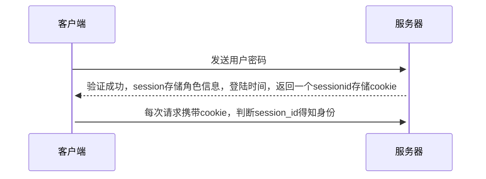

## 传统的用户认证cookie和session认证·



<span style="color:red">缺点</span> 

* 不同服务器之间不能共享session

<span style='color:green'>解决方法</span>

* session持久化，写入数据库，但是缺点是工程量大
* 服务器不保存session数据，全部保存客户端现在的jwt

## jwt数据结构


- Header（头部）
- Payload（负载）
- Signature（签名）

### header 

头部一般是json对象，描述jwt的算法和令牌类型，都通过base64加密

```json
{
  "alg": "HS256", //签名算法
  "typ": "JWT" //令牌类型
}
```

### payload

json对象，用来存放需要传递数据，jwt规定7个官方字段

```
iss (issuer)：签发人
exp (expiration time)：过期时间
sub (subject)：主题
aud (audience)：受众
nbf (Not Before)：生效时间
iat (Issued At)：签发时间
jti (JWT ID)：编号
```

除此之外还可以定义私有字段，默认不加密，不要放密码，例如

```
{
  "sub": "1234567890",
  "name": "John Doe",
  "admin": true
}
```

### Signature

是对前两部分的签名，指定一个密钥，密钥只有服务器能够使用

## node的jwt验证

### 过程

1.前端发送账号密码之后
2.后端通过插件生成token
3.前端请求携带token
4.后端判断token有效期

本操作步骤，是在express脚手架下进行的，请自行安装

> 首先下载jsonwebtoken插件

```shell
$ npm i jsonwebtoken -s
```

```js
var jwt=require("jsonwebtoken")
var jwtCode="asdfasfasdgsdgsfsadgdsgsfdsfdsfsdf" //随便命名一些规则

router.get('/login', function(req, res, next) {
  const {name,password}=req.query
  //密码验证
  if(name==userInfo.name&&password==userInfo.password){
    //生成token
    jwt.sign({name},jwtCode,{expiresIn: '30s'},(err,token)=>{
      if(err)return res.send(err)
      res.json({name,msg:"登陆成功",token})
    })
    
  }else{
    res.send("账户或密码输入错误，请重新输入")
  }
});

```

官网中定义的jwt.sign语法

```js
jwt.sign(payload, secretOrPrivateKey, [options, callback])
```

* `payload`可以是表示有效 JSON 的对象文字、缓冲区或字符串。
* `secretOrPrivateKey`是一个字符串、缓冲区或对象,其中包含 HMAC 算法的秘密或 RSA 和 ECDSA 的 PEM 编码私钥,我用于混淆token
* `options`常用：
  * `algorithm`（默认`HS256`：）
  * `expiresIn`: 如果不写单位默认为毫秒 (days, hours, etc)

```js
//登陆后校验token
router.get("/afterlogin",function(req,res,next){
  const {headers}=req
  const token=headers["authorization"].split(" ")[1]
  //校验方法
  jwt.verify(token,jwtCode,(err,paload)=>{
    if(err) res.sendStatus(403)
    res.json({msg:"认证成功",paload})
  })
})

```

 校验语法

```
jwt.verify(token, secretOrPublicKey, [options, callback])
```

* token就是前端传过来的token，一般会带上bearer，通过处理取到后面的token

## 参考链接

http://www.ruanyifeng.com/blog/2018/07/json_web_token-tutorial.html